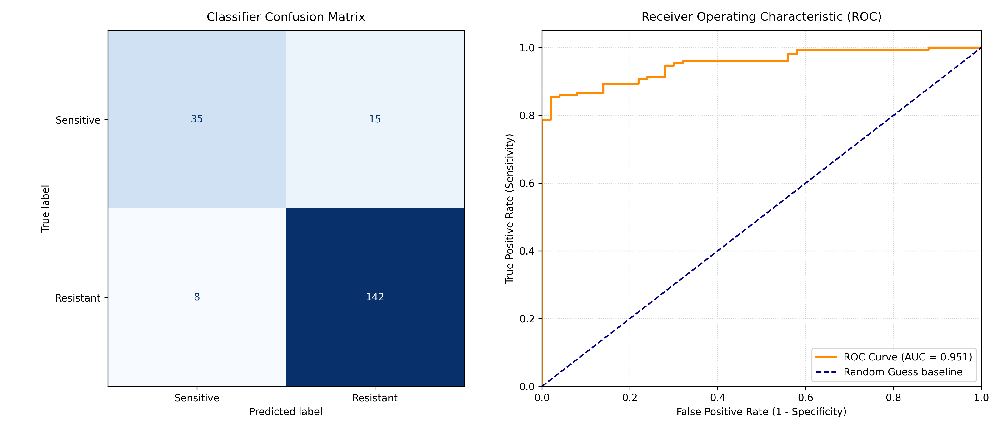

# Clinical Decision Support System (CDSS) for Antibiotic Resistance & Dosing Prediction

A modular, Python-based machine learning and algorithmic pipeline designed to predict microbial resistance profiles and optimize patient-specific antibiotic dosing. This repository demonstrates how to integrate clinical domain knowledge with supervised machine learning and deterministic physiological modeling.

##  Project Overview
In clinical settings, delayed identification of antibiotic resistance leads to sub-optimal treatment outcomes. This project implements a structural end-to-end framework that:
1. **Generates** a synthetic cohort of patients with complex clinical features.
2. **Trains** a Random Forest classifier to predict the probability of encountering a drug-resistant bacterial strain.
3. **Calculates** real-time physiological metrics (Creatinine Clearance via the Cockcroft-Gault equation) to adjust drug dosage matrices dynamically.
4. **Evaluates** model safety profiles using diagnostic classification analytics.

## Repository Architecture
The system is divided into discrete, decoupled modules to mirror professional production software engineering pipelines:

*   `data_pipeline.py`: Handles cohort simulation, stochastic variable assignment, and physiologic calculations (`Pandas`, `NumPy`).
*   `model_engine.py`: Controls feature scaling, train-test splitting, and classification modeling (`Scikit-Learn`).
*   `dosage_solver.py`: Contains the deterministic business logic matrix optimizing safe drug volume and interval limits.
*   `analytics_visualizer.py`: Generates structural, publication-ready metric evaluation plots (`Matplotlib`).
*   `app_orchestrator.py`: The main execution script acting as the pipeline's centralized runtime engine.

## Mathematical Framework

### 1. Physiological Clearance
Renal drug clearance performance is calculated utilizing the standardized Cockcroft-Gault formula for estimated Creatinine Clearance ($CrCl$):

$$CrCl = \frac{(140 - \text{Age}) \times \text{Weight (kg)}}{72 \times \text{Serum Creatinine (mg/dL)}}$$

### 2. Stochastic Label Assignment
Ground-truth resistance labels are systematically derived through an underlying probability threshold equation based on patient age and prior antibiotic exposure variables:

$$\text{Risk Score} = (\text{Prior Exposures} \times 1.5) + (\text{Age} \times 0.02) + \mathcal{N}(0, 1)$$

## Getting Started

### Prerequisites
Ensure you have a Python 3.9+ environment configured. Install the standard data science dependency stack via pip:

```bash
pip install numpy pandas scikit-learn matplotlib
```

### Running the Complete Pipeline
To execute the data pipeline, train the predictive classifier, calculate individual target dosage optimizations, and export diagnostic evaluation charts, execute the orchestrator script:

```bash
python app_orchestrator.py
```

To isolate and generate model evaluation charts independently:

```bash
python analytics_visualizer.py
```

## Model Performance Verification
The system automatically exports diagnostic validation visualization metrics as `model_evaluation_metrics.png`. 

*   **Confusion Matrix:** Evaluates model classification safety margins, allowing researchers to monitor and minimize high-risk False Negatives.
*   **ROC-AUC Curve:** Measures global classification accuracy thresholds across varying True Positive / False Positive operational trade-offs.



